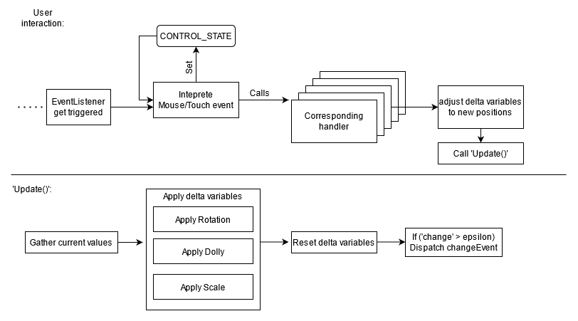

# Orbit Camera Controls

- Controls the movement of the camera inside the in-game viewport
- Class `GameBoardOrbitControl` overrides THREEs `OrbitControls` to allow for custom camera movement

---

The basic concept can be described with the diagramm:

Every time the user interacts with the viewport with a mouse or touch event, the signal is interpreted based on both the
current `CONTROLE_STATE` and the actual input the user made. The `CONTROL_STATE` describes previous actions of a user to
allow for things like "dragging" the camera by holding down the right mouse button and moving it afterwards. The initial
"mouse-right-button-down" action of the user is kept as the `CONTROL_STATE` to act as memory to recognize the mouse movement
as the user wanting to rotate the camera rather than just moving the to click an interface element.

Depending on the handler selected by the EventListeners, a corresponding `start`, `end` or `delta` member variable will
be adjusted to represent the movement done by the user. All `delta` variables will then be fed to the `update()` function
that will apply each change in **rotation**, **dolly** or **scale/pan** to the cameras position and lookAt value.

> NOTE: The `update()` function does not have input or output parameters. All actions are realized through the member
> variables `dt` (input) and the `camera` (output). The values found in the object `m` describe variables used (nearly)
> exclusively in the `update()` function. This is done to avoid re-allocation of variables everytime `update()` is called.

---

## Configuring

The orbit controls can be configured through a multitude of variables depending on the movement wanted:

|     Variable      |  Default  | Description                                                                                          |
| :---------------: | :-------: | ---------------------------------------------------------------------------------------------------- |
|      enabled      |   true    | enables or disables the user interaction with the controls                                           |
|    enableZoom     |   true    | enables or disables dollying in and out of the scene                                                 |
|   enableRotate    |   true    | enables or disables rotation along the spherical coordinate theta (equator)                          |
|    enableKeys     |   true    | enables or disables the keyboard listener of the control                                             |
| enableDollyAngle  |   true    | enables or disables the custom height function when dollying in and out of the scene                 |
|  enableDampening  |   true    | enables or disables the slow decay of movement when rotating or moving back and forth                |
|      EPSILON      |   0.001   | threshold value after which a change is significant enough to issue a changeEvent                    |
|  minTargetOffset  |     0     | minimum distance the camera can have to the target/center                                            |
|  maxTargetOffset  |    55     | maximum distance the camera can have to the target/center                                            |
|     minRadius     |    10     | minimum radius of the sphere the camera is moving on                                                 |
|     maxRadius     |    100    | maximum radius of the sphere the camera is moving on                                                 |
|     minTheta      | -infinity | minimum theta angle the cameras position can have in spherical coordinates                           |
|     maxTheta      | inifnity  | maximum theta angle the cameras position can have in spherical coordinates                           |
|      minPhi       | PI\*0.48  | minimum phi angle the cameras position can have in spherical coordinates                             |
|      maxPhi       |  PI\*0.2  | maximum phi angle the cameras position can have in spherical coordinates                             |
| targetOffsetSpeed |    25     | speed at which the targetOffset increases and decreases (moving the camera in and out)               |
|     zoomSpeed     |     1     | speed at which the sphere radius increases and decreses (dollying in and out)                        |
|    rotateSpeed    |     1     | speed at which the theta angle of the camera position is changed (moving left and right)             |
|    minRotSpeed    |    0.1    | minimum speed 'rotateSpeed' is constraint to in one update cycle                                     |
|    maxRotSpeed    |    0.7    | maximum speed 'rotateSpeed' is constraint to in one update cycle                                     |
| rotSpeedCurvature |    0.1    | curvature of the berzier curve adjusting rotation speed based on the targetOffset length             |
|  dollyCurvature   |    1.0    | curvature of the berzier curve adjusting the camera position height based on the targetOffset length |
|  dampeningFactor  |    0.1    | factor at which a movement decays per update cycle, 0.1 = 10% per cycle                              |

> Mouse ( and Touch ) bindings can be changed by adjusting the corresponding mapping objects found besides the configuration parameters
